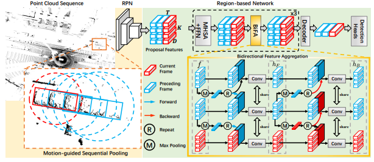

## MSF: Motion-guided Sequential Fusion for Efficient 3D Object Detection from Point Cloud Sequences (CVPR2023)[\[paper\]](https://openaccess.thecvf.com/content/CVPR2023/papers/He_MSF_Motion-Guided_Sequential_Fusion_for_Efficient_3D_Object_Detection_From_CVPR_2023_paper.pdf)

**Authors**: [Chenhang He](https://github.com/skyhehe123), Ruihuang Li, [Yabin Zhang](https://github.com/YBZh) [Shuai Li](https://github.com/strongwolf), [Lei Zhang](https://www4.comp.polyu.edu.hk/~cslzhang/).

This project is built on [OpenPCDet](https://github.com/open-mmlab/OpenPCDet).

## Updates


The performance of MSF 4 frames on Waymo valdation split are as follows. 

|         |  % Training | Car AP/APH | Ped AP/APH | Cyc AP/APH  | Log file |
|---------|:-:|--------|--------|--------|--------|
|  Level 1 | 100% |   81.50/81.02 | 85.10/82.19  |  78.46/77.66  | [Download](https://drive.google.com/file/d/1yYM5Qsy1EnbTTLDyn_vFsdf0X3va26yYDuN/view?usp=sharing)
|  Level 2 | 100% |   73.95/73.50 | 78.03/75.21  |  76.21/75.43  |


## Introduction

Point cloud sequences are commonly used to accurately detect 3D objects in applications such as autonomous driving. Current top-performing multi-frame detectors mostly follow a Detect-and-Fuse framework, which extracts features from each frame of the sequence and fuses them to detect the objects in the current frame. However, this inevitably leads to redundant computation since adjacent frames are highly correlated. In this paper, we propose an efficient Motion-guided Sequential Fusion (MSF) method, which exploits the continuity of object motion to mine useful sequential contexts for object detection in the current frame. We first generate 3D proposals on the current frame and propagate them to preceding frames based on the estimated velocities. The points-of-interest are then pooled from the sequence and encoded as proposal features. A novel Bidirectional Feature Aggregation (BiFA) module is further proposed to facilitate the interactions of proposal features across frames. Besides, we optimize the point cloud pooling by a voxel-based sampling technique so that millions of points can be processed in several milliseconds

## Training
The training of MSF is similar to MPPNet, first train the RPN model
```shell
bash scripts/dist_train.sh ${NUM_GPUS} --cfg_file cfgs/waymo_models/centerpoint_4frames.yaml
```
The ckpt will be saved in ../output/waymo_models/centerpoint_4frames/default/ckpt.
Then Save the RPN model's prediction results of training and val dataset
```shell
# training
bash scripts/dist_test.sh ${NUM_GPUS}  --cfg_file cfgs/waymo_models/centerpoint_4frames.yaml \
--ckpt ../output/waymo_models/centerpoint_4frames/default/ckpt/checkpoint_epoch_36.pth \
--set DATA_CONFIG.DATA_SPLIT.test train
# val
bash scripts/dist_test.sh ${NUM_GPUS}  --cfg_file cfgs/waymo_models/centerpoint_4frames.yaml \
--ckpt ../output/waymo_models/centerpoint_4frames/default/ckpt/checkpoint_epoch_36.pth \
--set DATA_CONFIG.DATA_SPLIT.test val
```
The prediction results of train and val dataset will be saved in \
../output/waymo_models/centerpoint_4frames/default/eval/epoch_36/train/default/result.pkl,
../output/waymo_models/centerpoint_4frames/default/eval/epoch_36/val/default/result.pkl.

After that, train MSF with
```shell
bash scripts/dist_train.sh ${NUM_GPUS} --cfg_file cfgs/waymo_models/msf_4frames.yaml --batch_size 2 
```


## Evaluation
```shell
# Single GPU
python test.py --cfg_file cfgs/waymo_models/msf_4frames.yaml  --batch_size  1 \
--ckpt  ../output/waymo_models/msf_4frames/default/ckpt/checkpoint_epoch_6.pth
# Multiple GPUs
bash scripts/dist_test.sh ${NUM_GPUS} --cfgs/waymo_models/mppnet_4frames.yaml  --batch_size  1 \
--ckpt  ../output/waymo_models/msf_4frames/default/ckpt/checkpoint_epoch_6.pth
```


### Citation
```
@InProceedings{He_2023_CVPR,
    author    = {He, Chenhang and Li, Ruihuang and Zhang, Yabin and Li, Shuai and Zhang, Lei},
    title     = {MSF: Motion-Guided Sequential Fusion for Efficient 3D Object Detection From Point Cloud Sequences},
    booktitle = {Proceedings of the IEEE/CVF Conference on Computer Vision and Pattern Recognition (CVPR)},
    month     = {June},
    year      = {2023},
    pages     = {5196-5205}
}
```
